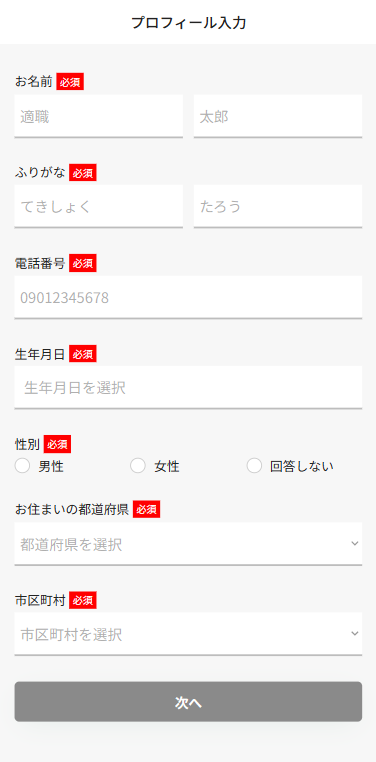

# プロフィールを登録する

会員登録すると、プロフィールの入力画面に遷移します。

ここでは、あなたの基本的な情報の入力を行います。


入力した情報は個人を特定できないように、お名前・電話番号・メールアドレスを伏せた状態で企業に公開されます。\
エントリーシートの提出を行うと、全ての情報が企業に公開されます


<figure><figcaption></figcaption></figure>

#### お名前・ふりがな(必須)

苗字と名前に分けて本名を入力してください。それぞれ10文字まで入力することができます。


外国籍の方など文字数が足りない場合は入力できる範囲で入力してください


#### 電話番号(必須)

携帯電話をお持ちの方は携帯電話の番号を入力してください

#### 生年月日(必須)

#### 性別

#### お住まいの都道府県

#### 市区町村

すべての項目を入力後、「次へ」ボタンを押してください
