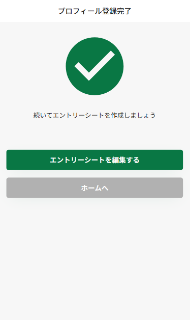
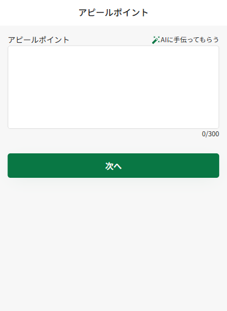

# エントリーシートの入力

<figure><figcaption></figcaption></figure>

プロフィールの入力後、「エントリーシートを編集する」ボタンを押します・

### 最終学歴・雇用状況の入力

<figure><figcaption></figcaption></figure>

最終学歴と現在の就業状況を選択し、「職務経歴の入力へ」を押します

### 職務経歴の入力

<figure><figcaption></figcaption></figure>

直近の職務経歴を登録します。雇用形態を選択し、職務内容を簡単に入力してください。「AIに手伝ってもらう」から文章を生成することもできます。

入力が終わったら「職務経歴を登録する」を押します。

<figure><figcaption></figcaption></figure>

「次へ」を押します


職務経歴は合計3つまで登録することができます


### 資格の入力

<figure><figcaption></figcaption></figure>

取得済みの資格を選択し、「次へ」を押します

### アピールポイントの入力

<figure><figcaption></figcaption></figure>

企業にアピールしたい内容を記載してください。AIで生成することもできます

### 希望条件を入力

<figure><figcaption></figcaption></figure>

希望条件を入力します。転職希望時期・希望月収を選択後、希望雇用形態と希望職種について、当てはまるものをチェックしてください

<figure><figcaption></figcaption></figure>

仕事選びについて重視するポイントを5段階で選択してください

最後に、「エントリーシートを登録する」を押すと、エントリーシートの入力は完了です。
